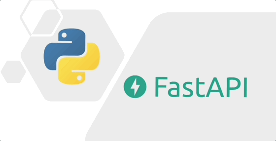
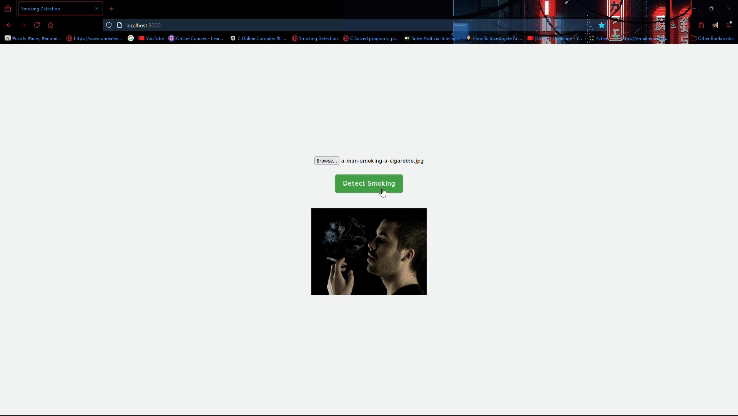

# SMOKE-DETECTION: END TO END ML PROJECT
<div align="center">
  
</div>

## Overview
- Data Preparation: Images from Kaggle are organized into "smoking" and "notsmoking" folders.
- Model Training: A VGG16 model is used for image classification, fine-tuned with your dataset.
- Deployment: The model is integrated into a FastAPI application.
- Containerization: The application and its dependencies are containerized using Docker.
- Exposing the App: Ngrok is used to create a secure tunnel to access the local FastAPI app from anywhere.
- Testing: Users can upload images through a web interface to get real-time predictions.

## 1.Data Preparation
### 1.1. Get Data: KaggleAPI
```bash
#make sure to change username and dataset name
kaggle datasets download -d vitaminc/cigarette-smoker-detection
```
```bash
unzip cigarette-smoker-detection.zip -d dataset
```
###  1.2. Organize the Dataset:
Ensure your dataset has the following structure:
```bash
dataset/
├── smoking/
└── notsmoking/
```
### 1.3. Preprocess the Data:
- Resize & Normalize:
  ```python
  from tensorflow.keras.preprocessing.image import ImageDataGenerator

  datagen = ImageDataGenerator(rescale=1./255)
  train_generator = datagen.flow_from_directory(
      'dataset/',
      target_size=(224, 224),
      batch_size=32,
      class_mode='binary'
  )
  ```
- Split Data:
    ```python
    from sklearn.model_selection import train_test_split
    image_paths, labels = # Your image paths and labels
    train_paths, val_paths, train_labels, val_labels = train_test_split(
    image_paths, labels, test_size=0.2, random_state=42
    )
    ```
### 1.4. Data Augmentation:
```python
datagen = ImageDataGenerator(
    rescale=1./255,
    rotation_range=40,
    width_shift_range=0.2,
    height_shift_range=0.2,
    shear_range=0.2,
    zoom_range=0.2,
    horizontal_flip=True,
    fill_mode='nearest'
)
```
### 1.5. Create Data Loaders:
```python
train_generator = datagen.flow_from_directory(
    'dataset/train/',
    target_size=(224, 224),
    batch_size=32,
    class_mode='binary'
)
```

## 2.Model Training
### 2.1. Load Pretrained VGG16:
Use a pretrained VGG16 model with weights from ImageNet:
```python
from tensorflow.keras.applications import VGG16
from tensorflow.keras.models import Model
from tensorflow.keras.layers import Dense, Flatten

base_model = VGG16(weights='imagenet', include_top=False, input_shape=(224, 224, 3))

```
### 2.2. Add Custom Layers:
Add classification layers on top of the base model:
```python
x = base_model.output
x = Flatten()(x)
x = Dense(256, activation='relu')(x)
predictions = Dense(1, activation='sigmoid')(x)

model = Model(inputs=base_model.input, outputs=predictions)

```
### 2.3. Compile the Model:
Compile the model with an optimizer, loss function, and metrics:
```python
model.compile(optimizer='adam', loss='binary_crossentropy', metrics=['accuracy'])
```
### 2.4. Train the Model:
Train the model using the training and validation data:
```python
history = model.fit(
    train_generator,
    epochs=10,
    validation_data=val_generator
)
```
### 2.5. Save the Model:
Save the trained model for future use:
```python
model.save('smoke_detection_model.h5')
```
## 3. Deployment: FastAPI
<div align="center">
  
</div>

- Create a FastAPI App:
Define an API for image uploads and predictions:
```python
app = FastAPI()
model = load_model('smoke_detection_model.h5')

@app.post("/predict")
async def predict(file: UploadFile = File(...)):
    img = Image.open(io.BytesIO(await file.read())).resize((224, 224))
    img_array = np.expand_dims(np.array(img) / 255.0, axis=0)
    prediction = model.predict(img_array)[0][0]
    label = "Smoking" if prediction > 0.5 else "Not Smoking"
    return {"label": label, "confidence": float(prediction)}

@app.get("/")
def main():
    return HTMLResponse( #your html code for your webpage here )
```
## 4. Containerization:


### 4.1. Create Dockerfile:
Define how to build the Docker image:
```Dockerfile
# Use an official Python runtime as a parent image
FROM python:3.8-slim

# Set the working directory in the container
WORKDIR /app

# Copy the current directory contents into the container at /app
COPY . /app

# Install any needed packages specified in requirements.txt
RUN pip install --no-cache-dir -r requirements.txt

# Make port 5000 available to the world outside this container
EXPOSE 5000

# Run app.py when the container launches
CMD ["uvicorn", "app.app:app", "--host", "0.0.0.0", "--port", "5000", "--reload"]
```
### 4.2. Buid Docker Image:
```bash
docker build -t smoke-detector-app .
```
### 4.3. Run Image:
```bash
docker run -d -p 5000:5000 smoke-detector-app
```

## 5. Exposing localhost:
Exposing local host so you can work with team or make your client test the project
```bash
ngrok http 5000
```
## 6. Testing:
<div align="center">
  
</div>

Open localhost or ngrok url to test your project
```bash
http://localhost:5000/
```

# Make Sure depencies are correctly installed
# [RECOMMENDED] Create a new conda env to avoid dependencies conflict with your main env   
